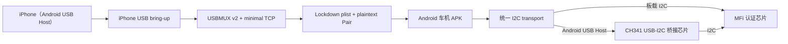

# 目标架构

本文档描述目标架构，不代表当前代码已经实现。当前实现状态见
[status.md](status.md)。

## 目标硬件链路

板载 I2C 和 CH341 是同一 MFi 认证层的两个可选 transport，实际部署时二选一。
iPhone 的 USB bring-up 边界已实现：先请求 CarPlay configurations，等待 Android USB 重枚举，
重新授权后选择 configuration 6，再严格打开 USBMUX raw pipe（interface 1、bulk OUT `0x04`、bulk IN
`0x85`）。其上已有未验证的 USBMUX v2 framing、到 port `62078` 的最小 TCP 字节流，以及四字节大端长度
前缀 UTF-8 XML plist framing；它只安全解析/写出 Lockdown 所需的最小值集合，并有明文 Pair 客户端及后续
TLSv1.2/1.3 双工字节流。最小客户端可在会话 TLS 上发送 StartService 并返回新建的 carkit 服务流；其后的纯 iAP2 链路帧状态机、基础 CSM framing 与最小 wired Identification 已实现，但 MFi 会话绑定、其他 CSM 业务消息、NCM、AirPlay 与媒体链路仍未实现，也没有实机验证。

`LockdownPairingClient` 在 worker thread 上从已有 USBMUX host 新建一个 `62078` 连接，以明文 GetValue
取得 DevicePublicKey/WiFiAddress 并发送 Pair。pending 对话每秒重发同一请求，支持总超时和取消；结果始终关闭
自己创建的 channel/TCP 连接。它不持久化配对材料，也不启动会话、TLS、服务、iAP2 或 CarPlay 会话。

## 逻辑分层

| 层 | 主要职责 | 当前状态 |
|---|---|---|
| Android UI | CarPlay 画面、状态、设置、触摸和按键 | 模板 Compose UI |
| Car App Service | 服务生命周期和车机宿主交互 | 模板实现 |
| Lockdown plist / Pair | `62078` 上的长度前缀 XML plist 收发及明文配对 | 最小 dict/string/integer/bool/data 支持；阻塞式 GetValue/Pair，TLS 由下一层单独提供 |
| Lockdown 配对材料 | DevicePublicKey/WiFiAddress 到内存 PairRecord | 仅 JCA/最小 DER 证书生成及 plist 字典转换；Pair 成功记录与可选 EscrowBag 不持久化 |
| Lockdown TLS 字节流 | PairRecord 与现有双工 transport 到 TLS 明文流 | `SSLEngine` 阻塞握手及连续 send/recv；仅 TLSv1.2/1.3，不含 StartSession/StartService，API 29 未验证 |
| Lockdown carkit 打开路径 | StartSession → TLS → StartService → 新服务流 | connect/receive/engine 预算五秒、写沿用底层有界超时；仅现代 TLSv1.2/1.3，不含 legacy/iAP2/持久化/UI，实机未验证 |
| iAP2 链路层 | marker、LSP、可靠帧、session 10 原始字节 | `Iap2LinkEngine` 纯 sans-I/O 实现，`Iap2LinkChannel` 在 owned carkit stream 上以唯一 worker 驱动它；`Iap2CsmFramer` 负责基础 CSM framing；实机未验证，不含业务会话 |
| CarPlay 协议层 | CSM、认证、控制通道、媒体通道 | wired Identification、CSM MFi 与 `Iap2WiredControlClient` 已实现：Identification→MFi→`AE03`→`5000`/`5200`/`AE00`/`4157`/`4154`，并对每个 `4300` 回 wired `4301`。它只在调用方提供 IPv6/port/public-key/source-version 后编码控制消息；不含 NCM、AirPlay、媒体或 UI，实机未验证 |
| MFi 认证层 | 芯片枚举、证书读取、challenge-response | `0x00` device-version 的 first-success 扫描、证书读取与 digest 签名的纯 Kotlin 逻辑已实现，实机未验证 |
| MFi 寄存器层 | `0x30/0x20/0x21/0x10/0x11/0x12` 流程 | 上述寄存器流程已实现为纯 Kotlin 客户端，硬件行为未验证 |
| CH341 I2C 层 | USB 控制命令、I2C stream、读写重试 | Kotlin stream 编码、每方向最多 65,535-byte 事务与 Android bulk 传输已实现；大事务 continuation/状态语义未验证 |
| 板载 I2C 层 | JNI `I2C_RDWR` 访问 `/dev/i2c-N` | 代码已实现；受 Android SELinux 和 Unix 节点权限约束，未实机验证 |
| USB Host 层 | CH341 与 iPhone 的发现、权限、重枚举和接口/端点管理 | iPhone USBMUX raw pipe 与最小 TCP 已实现，实机未验证 |
| 硬件 | 车机 USB Host、CH341、MFi 芯片、供电和电平 | 未验证 |

## 建议模块边界

### `shared`

保留 Car App Library 的服务、会话和页面模板，作为车机入口和宿主适配层。

### USB 与 CH341 层

应建立独立模块或包，避免把 USB 传输细节散落到 UI：

- Android `UsbManager` 或 libusb/JNI 设备发现
- CH341 模式、VID/PID、接口、端点和批量传输
- CH341 vendor protocol 到 I2C 原语的映射
- 总线忙、NAK、超时和重试处理

CH341 stream 指令和 MFi 寄存器基线见
[ch341_mfi_interface.md](ch341_mfi_interface.md)。

### 板载 I2C 层

板载 I2C 后端应与 CH341 后端实现同一 transport 接口：

- 系统 I2C、Android I2C HAL 或 native `/dev/i2c-N`
- 7-bit 设备地址和 8-bit 写/读地址转换
- 与 CH341 后端一致的超时、重试和错误类型

当前 `LinuxI2cTransport` 已采用 native `/dev/i2c-N`：每次 transaction 通过一个 Linux
`I2C_RDWR` ioctl 提交纯写、纯读或 write + repeated-start read。它不修改 SELinux policy，
也不提升应用权限；目标系统必须显式允许应用访问相应设备节点。

### MFi 认证层

应只依赖统一 I2C transport：

- 芯片地址扫描
- 型号和协议版本读取
- 证书读取
- challenge 签名
- 日志和可复现的故障码

MFi 认证层必须同时调用板载 I2C 和 CH341 transport，不能直接编码 CH341
stream。

### CarPlay 层

应只消费 MFi 认证结果，不直接访问 CH341：

- 设备配对与认证
- 控制通道
- 音频和视频通道
- 触控、按键和传感器回传

### iPhone USB bring-up 层

`IphoneUsbHost` 是 CarPlay 主链在 iAP2 之前的 Android USB Host 边界。它只接受部署时提供的精确
Apple VID/PID 列表；LIVI 固定提交只证实 Apple VID `0x05AC`，没有可安全内置的稳定 PID 列表。它在
后台发送已记录的 Apple vendor request `0x52`，关闭旧连接并等待 `ACTION_USB_DEVICE_ATTACHED`；新
设备重新获得权限后才选择 configuration `6`，并且只接受 USBMUX interface `1` 的 bulk OUT `0x04`、
bulk IN `0x85`；`Iap2UsbSession` 以 65536 字节 chunk 执行原始 blocking I/O。`Iap2UsbMuxHost` 在其
上执行 USBMUX v2 version/setup、16 字节流式 framing 和最小 TCP（port `62078`）。`LockdownPlistChannel`
在该连续字节流上提供四字节大端长度前缀的 UTF-8 XML plist 收发；Android PullParser 跳过标准 plist
`DOCTYPE` 而不处理其 DTD 或实体。它不实现
Lockdown Pair、StartSession、TLS、StartService 或 carkit，不解析 iAP2 帧，也不声称已建立 CarPlay 会话。

## 建议实施阶段

| 阶段 | 验收条件 |
|---|---|
| 0. 工程基线 | 文档完成，`mobile` 和 `automotive` debug APK 可构建 |
| 1. transport 发现 | 可枚举 CH341 或板载 I2C，并完成对应权限流程 |
| 2. I2C 原语 | 两个 transport 后端都能执行写、读和地址扫描 |
| 3. MFi 自检 | 可从 `0x10/0x11` 扫描出芯片并完成寄存器自检 |
| 4. MFi 认证 | challenge-response 通过，并可重复执行 |
| 5. iPhone USB bring-up | iPhone 完成 request、重新枚举、再次授权和 configuration 6 选择 |
| 6. USBMUX 最小 TCP | version/setup、framing 和至 port `62078` 的 TCP 字节流在实机验证 |
| 7. iAP2 链路 | 在 carkit TLS 字节流上驱动并验证 `Iap2LinkEngine`，保持 marker/LSP/ACK 链路 |
| 8. CarPlay 会话 | 在 session 10 原始字节之上实现并验证 CSM 控制通道与会话 |
| 8. 媒体与输入 | 画面、音频、触摸和按键链路可工作 |
| 9. 车机适配 | 在目标 Android 车机上完成启动、重连和异常恢复验证 |

## 硬件适配点

开始硬件代码前必须确认：

- CH341 具体型号和 I2C 模式配置。
- USB VID/PID、接口编号和批量端点。
- Android 车机是否支持 USB Host/OTG。
- MFi 芯片实际 I2C 地址。固定 LIVI 仅给出 `0x10`、`0x11` 候选；实际总线结果待硬件验证，
  不据此扩展协议事实。
- I2C 上拉电阻、逻辑电平、供电和隔离。
- 芯片固件/证书是否允许用于目标用途。

## 风险

- CH341 的 Android USB 协议不能假设与 Linux 内核驱动完全相同。
- Genymotion 不能可靠验证物理 USB 设备。
- MFi 认证层仅通过 I2C 基础读写不能证明 CarPlay 会话可用。
- 从 GPL 项目移植代码可能带来许可约束。
- 商业分发涉及 Apple MFi Program，不在本地源码范围内解决。
